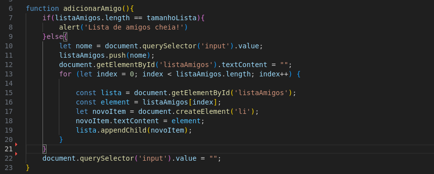

# DESAFIO AMIGO SECRETO

O desafio tem como objetivo demostrar de forma prática os conhecimentos em condicionais, estruturas de controle, arrays e manipulação de tags HTML

A quantidade de nomes na lista pode ser alterada na variável 'tamanhoLista', na linha 4 do arquivo app.js.

Ao clicar em adicionar, o nome dentro do input é adicionado em uma lista, cria-se através de um comando js um item de lista, esse item de lista é adicionado dentro da tag 'ul' no html, exibindo na tela o nome da pessoa que foi adicionada,
conforme for adicionando os nomes, essa lista é percorrida pela estrutura 'for', limitando-se ao tamanho da lista de nomes, e adicionando um item de lista para cada item dentro da lista.

Para o sorteio, foi utilizado a função random(), multiplicado pelo tamanho da lista, e usado a função parseInt() que nos devolve um interio, onde será usado como parâmetro pra buscar um item especifico da lista de nomes e exibi-lo na página.
